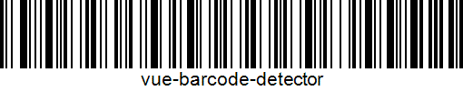

# Vue3 Barcode Detector

[](https://img.shields.io/badge/Programic-black)
[](https://badge.fury.io/js/@programic%2Fvue3-tooltip)
[](https://img.shields.io/badge/Vue-3-green)
[](https://img.shields.io/badge/TypeScript-blue)
[](https://img.shields.io/badge/TypeScript-yellow)



This package contains Programic's Vue Barcode Detector for Vue 3, which can be used for detecting the input of
physical USB barcode scanners. These devices often fire keyboard events on scanning a barcode, which
can be detected and compiled by the [Vue composable](https://vuejs.org/guide/reusability/composables) included in this package.

It's very easy to use! Take a look at this simple implementation in a Vue component:

```vue
<script setup lang="ts">
import useBarcodeDetector, { ScannedBarcodeData } from '@programic/vue-barcode-detector';

const barcodeDetector = useBarcodeDetector();

barcodeDetector.listen((barcodeData: ScannedBarcodeData): void => {
    console.log(barcodeData);
    // Logs: { 'timestamp': <SCANNED_TIME_TIMESTAMP>, 'value': <SCANNED_BARCODE_VALUE> }
});
</script>
```

For example: The barcode contains a value like `9146791273`. Barcode scanner devices will trigger each separate character
like a keyboard input event, which is followed by an Enter key. Because it fires these key events quite rapidly, the detector will
listen to a very short timeout before resetting so that it doesn't trigger on normal keyboard inputs.

## Installation

Install `@programic/vue-barcode-detector` in your project with NPM or Yarn:

```sh
npm install @programic/vue-barcode-detector
```
```sh
yarn add @programic/vue-barcode-detector
```

## Usage

The `useBarcodeDetector()` function returns a composable containing three items:

### The 'listen' function

Can be used to start listening to barcode scanner devices on mounting a component. The function will
register several event listeners, and its only parameter is a callback function that is called after scanning
a barcode. The callback injects an object with a timestamp and the barcode value.

```ts
import useBarcodeDetector, { ScannedBarcodeData } from '@programic/vue-barcode-detector';

const barcodeDetector = useBarcodeDetector();

barcodeDetector.listen((barcodeData: ScannedBarcodeData): void => {
// barcodeData = { 'timestamp': <SCANNED_TIME_TIMESTAMP>, 'value': <SCANNED_BARCODE_VALUE> }
});
```

### The 'stop' function

Can be used to manually stop listening to the barcode scanner input.

```ts
import useBarcodeDetector from '@programic/vue-barcode-detector';

const barcodeDetector = useBarcodeDetector();

barcodeDetector.stopListening();
```

The composable will automatically call this function on `unMount()`, so that the event listeners will be removed from the browser's runtime. This will
avoid duplicate event listeners from being registered.

### The 'barcode' ref

After scanning a barcode, its value will be stored in a ref that is defined inside the composable.
The listen function will use this ref's value to return in the `listen()` callback, but it
may also be read directly for reactive triggers.

```vue
<script setup lang="ts">
import useBarcodeDetector from '@programic/vue-barcode-detector';

const barcodeDetector = useBarcodeDetector();
</script>

<template>
    <p>
        {{ barcodeDetector.barcode }}
    </p>
</template>
```

### TypeScript interfaces

This package also exports some interfaces that can be used for TypeScript implementations:

```ts
export interface ScannedBarcodeData {
  timestamp: number;
  value: string;
}

export interface BarcodeScannerListenerCallback {
  (barcodeData: ScannedBarcodeData): void;
}
```

## Requirements

| Dependency              | minimal version |
|-------------------------|-----------------|
| Vue (Composition API)   | ^3.4.38         |
